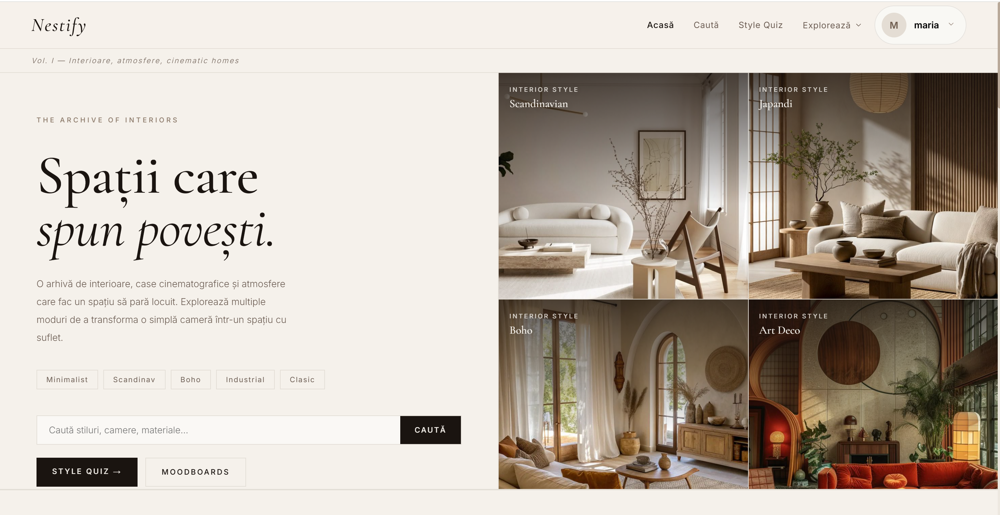
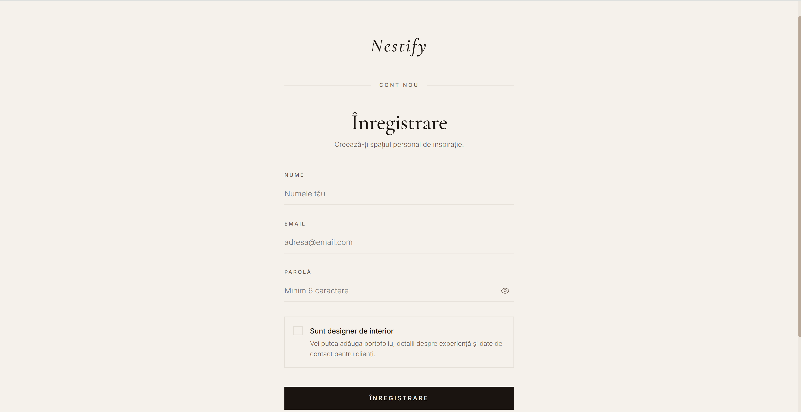
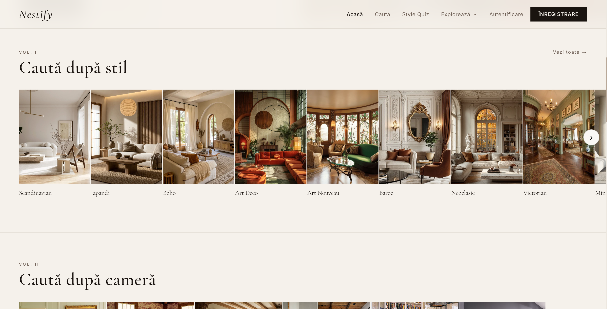
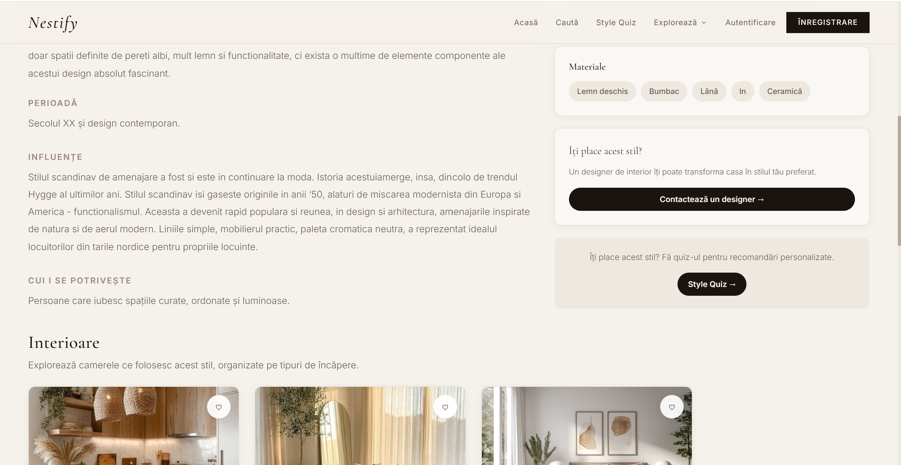
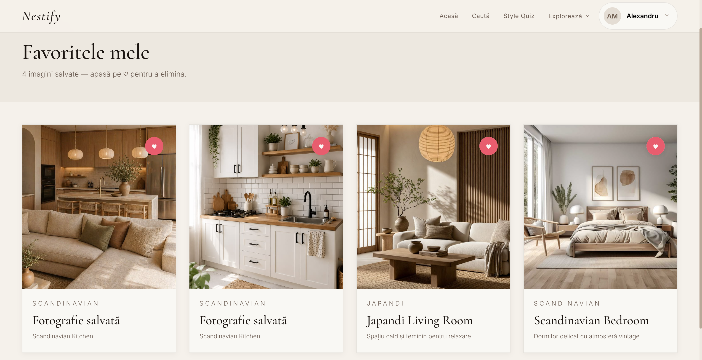
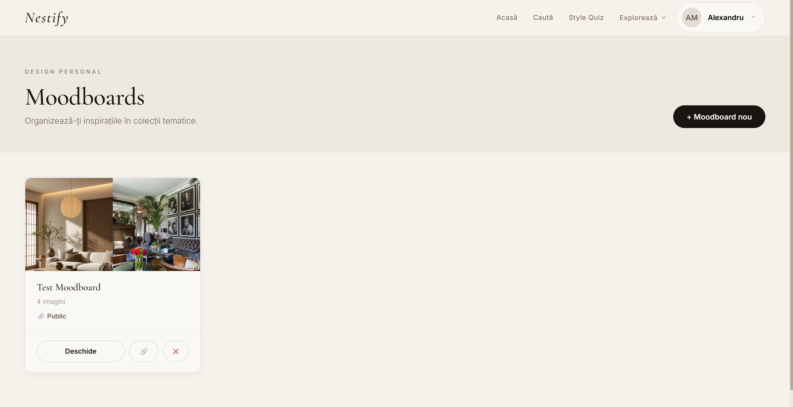
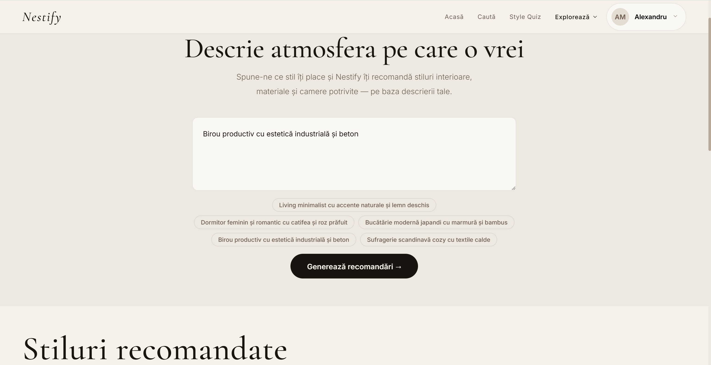
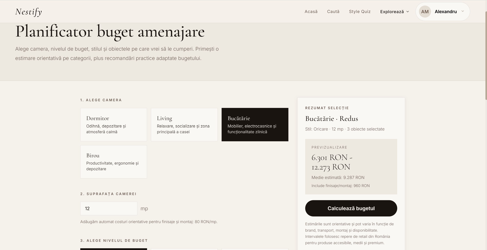
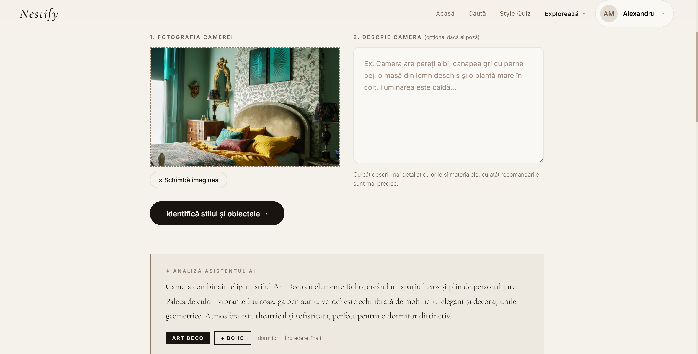
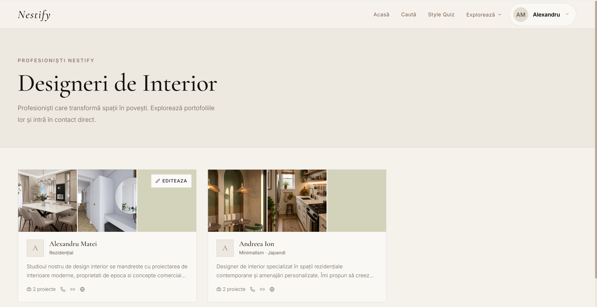

# Nestify – Interior Design Inspiration Platform

Nestify is a full-stack web application designed to help users discover, explore, and organize interior design inspiration. The platform combines modern web technologies with practical tools, allowing users to browse interior styles, create personalized moodboards, estimate renovation budgets, detect room types, and connect with professional interior designers.

Developed as a Bachelor's Degree Project, Nestify focuses on providing an intuitive, visually appealing, and user-friendly experience for anyone interested in interior design.

---

# Features

## Authentication

* User registration and login
* Secure JWT authentication
* Password reset functionality
* User profile management

## Interior Design Styles

* Browse multiple interior design styles
* Detailed information for each style
* High-quality image galleries
* Style comparison

## Favorites

* Save favorite styles
* Quick access to preferred designs
* Personalized inspiration collection

## Moodboards

* Create custom moodboards
* Organize design inspiration
* Share moodboards publicly
* Manage personal collections

## Interior Designers

* Browse professional interior designers
* Designer profile pages
* Portfolio presentation
* Contact information

## AI Assistant

* Interactive AI assistant
* Interior design recommendations
* Personalized suggestions
* User guidance

## Budget Estimator

* Estimate interior renovation costs
* Budget planning assistance
* Cost overview

## Room Detector

* Detect room characteristics
* Interior recommendations based on room type

## Stories & Inspiration

* Read interior design articles
* Discover decorating ideas
* Learn about design trends

## Projects

* Organize personal projects
* Track inspiration and ideas

## Admin Dashboard

* Manage application content
* Add or edit interior styles
* Manage users and resources

---

# Technologies

## Frontend

* React
* Vite
* Tailwind CSS
* React Router
* Axios

## Backend

* Node.js
* Express.js
* Prisma ORM

## Database

* PostgreSQL

## Authentication

* JSON Web Token (JWT)

## Media Storage

* Cloudinary

## Development Tools

* Visual Studio Code
* Git
* GitHub
* npm

---

# Project Structure

```
NestifyApp/
│
├── client/
│   ├── src/
│   ├── public/
│   └── package.json
│
├── server/
│   ├── prisma/
│   ├── src/
│   └── package.json
│
└── README.md
```

---

# Screenshots

## Home Page



---

## Login



---

## Discover Styles



---

## Interior Style Details



---

## Favorites



---

## Moodboards



---

## AI Assistant



---

## Budget Estimator



---

## Room Detector



---

## Designer Profile



---

# Installation

## Clone the repository

```bash
git clone https://github.com/YOUR_USERNAME/Nestify.git
```

## Navigate to the project

```bash
cd Nestify
```

## Install Frontend Dependencies

```bash
cd client
npm install
```

## Install Backend Dependencies

```bash
cd ../server
npm install
```

---

# Environment Variables

Create a `.env` file inside the **server** folder and configure the following variables:

```env
DATABASE_URL=
JWT_SECRET=
CLOUDINARY_CLOUD_NAME=
CLOUDINARY_API_KEY=
CLOUDINARY_API_SECRET=
```

Do **not** commit the `.env` file to GitHub.

---

# ▶ Running the Project

Start the backend:

```bash
cd server
npm run dev
```

Start the frontend:

```bash
cd client
npm run dev
```

The application will be available at:

Frontend:

```
http://localhost:5173
```

Backend:

```
http://localhost:5000
```

---

# Project Objectives

The main objective of Nestify is to simplify the process of discovering interior design inspiration by combining modern web technologies with practical tools that support users throughout their design journey.

The platform aims to:

* inspire users with curated interior styles;
* simplify project organization through moodboards;
* provide AI-assisted recommendations;
* help users estimate renovation costs;
* connect users with professional interior designers.

---

# Future Improvements

Possible future enhancements include:

* AI-generated room visualizations
* Product recommendation system
* Furniture shopping integration
* Social features and community interaction
* Mobile application
* Multi-language support
* Advanced search and filtering
* Real-time messaging with designers

---

# Academic Context

This project was developed as part of a Bachelor's Degree in Economic Informatics.

Nestify demonstrates the integration of modern frontend and backend technologies, database management, authentication, media handling, and responsive web application development.

---

# Author

**Sara Dumitru**

Bachelor's Degree Project – Economic Informatics

---

# License

This project is intended for educational and portfolio purposes.
